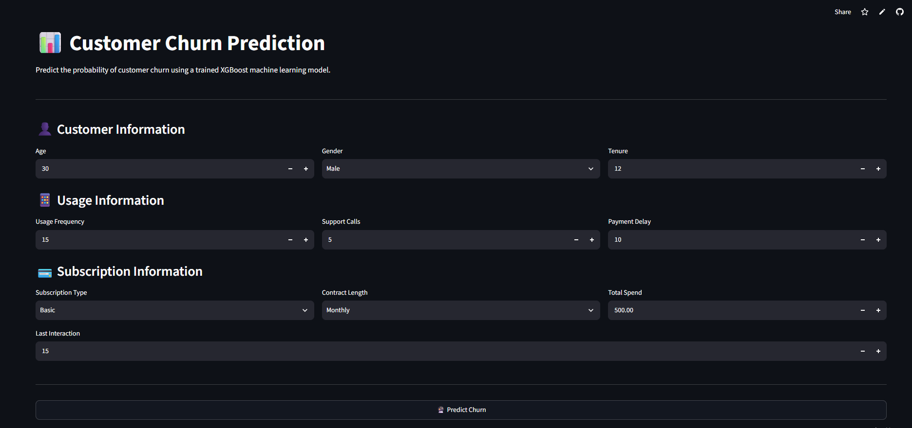
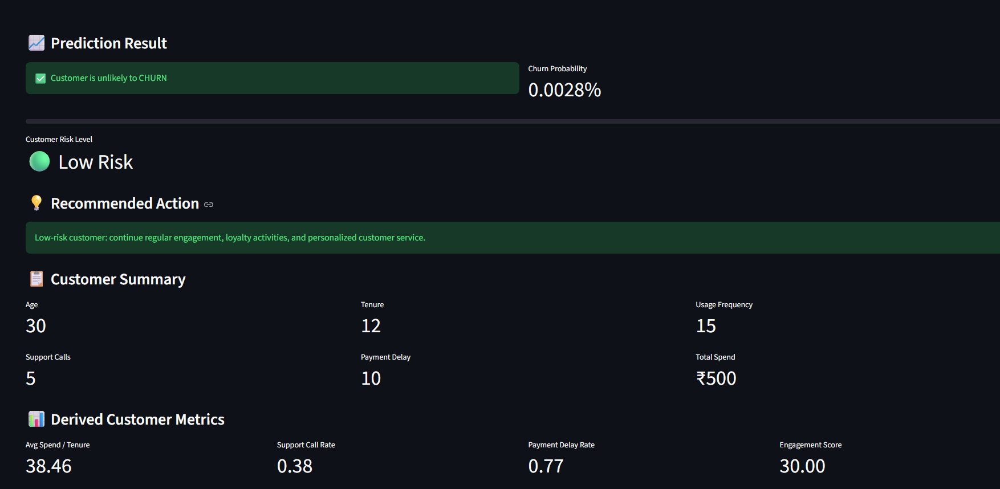
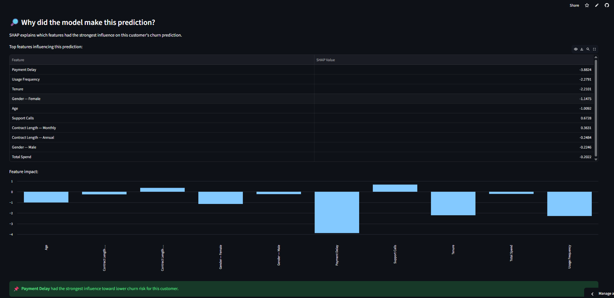

````markdown
# 📊 Customer Churn Prediction

A Machine Learning project that predicts whether a customer is likely to churn using an XGBoost classification model.

The project also uses SHAP (SHapley Additive exPlanations) to explain why the model made a particular prediction and provides an interactive Streamlit web application.

---

## 🚀 Live Demo

[Open Customer Churn Prediction App](https://customer-churn-prediction-nwsewnvcutao5taq8kv8th.streamlit.app/)

---

## 📸 Application Screenshots

### 👤 Customer Input



### 📈 Prediction Result



### 🔎 SHAP Explainability



---

## 🎯 Project Objective

Customer churn is an important business problem because losing customers can negatively affect business revenue.

The main objectives of this project are:

- Analyze customer behavior
- Perform Exploratory Data Analysis (EDA)
- Perform statistical analysis using ANOVA
- Create useful customer features
- Build a machine learning model
- Predict customer churn probability
- Classify customers into risk levels
- Explain predictions using SHAP
- Deploy the model using Streamlit

---

## 🧠 Project Workflow

```text
Customer Dataset
       ↓
Data Cleaning
       ↓
Exploratory Data Analysis
       ↓
Statistical Analysis
       ↓
ANOVA
       ↓
Feature Engineering
       ↓
Data Preprocessing
       ↓
XGBoost Model
       ↓
Model Evaluation
       ↓
Churn Prediction
       ↓
Risk Classification
       ↓
SHAP Explainability
       ↓
Streamlit Application
````

---

## 📂 Dataset

The dataset contains customer-level information related to demographics, usage behavior, support interactions, payment behavior, subscriptions, spending, and customer interactions.

### Dataset Features

| Feature           | Description                                             |
| ----------------- | ------------------------------------------------------- |
| Age               | Customer age                                            |
| Gender            | Customer gender                                         |
| Tenure            | Duration of customer relationship                       |
| Usage Frequency   | Frequency of service usage                              |
| Support Calls     | Number of support calls                                 |
| Payment Delay     | Payment delay information                               |
| Subscription Type | Customer subscription category                          |
| Contract Length   | Contract duration                                       |
| Total Spend       | Total customer spending                                 |
| Last Interaction  | Time since the customer's last interaction              |
| Churn             | Target variable indicating whether the customer churned |

---

## 🔧 Feature Engineering

Additional features are created to capture customer behavior and engagement.

### Average Spend per Tenure

```text
Avg Spend Per Tenure =
Total Spend / (Tenure + 1)
```

This represents customer spending relative to their relationship duration.

### Support Call Rate

```text
Support Call Rate =
Support Calls / (Tenure + 1)
```

This represents the frequency of customer support interactions relative to tenure.

### Payment Delay Rate

```text
Payment Delay Rate =
Payment Delay / (Tenure + 1)
```

This represents payment delay relative to customer tenure.

### Engagement Score

```text
Engagement Score =
Usage Frequency + Last Interaction
```

This provides an additional indicator of customer activity.

---

## 📊 Exploratory Data Analysis

Exploratory Data Analysis was performed to understand customer behavior and identify patterns related to churn.

The analysis includes:

* Customer demographic analysis
* Churn distribution
* Usage behavior
* Support call patterns
* Payment behavior
* Subscription analysis
* Spending analysis
* Customer tenure analysis
* Relationships between features and churn

---

## 📐 Statistical Analysis — ANOVA

ANOVA (Analysis of Variance) was used to determine whether there are statistically significant differences between the means of different customer groups.

### Hypotheses

**Null Hypothesis (H₀):**

There is no significant difference between the group means.

**Alternative Hypothesis (H₁):**

At least one group mean is significantly different.

The ANOVA test was used as part of the statistical analysis to understand relationships between customer characteristics and churn-related behavior.

---

## 🤖 Machine Learning Model

### XGBoost Classifier

XGBoost was selected as the primary machine learning algorithm.

XGBoost is a gradient boosting algorithm that builds multiple decision trees sequentially and combines them to produce a strong predictive model.

It is suitable for structured/tabular datasets and can capture nonlinear relationships between customer features.

### Machine Learning Pipeline

```text
Raw Customer Data
        ↓
Data Cleaning
        ↓
Feature Engineering
        ↓
Train/Test Split
        ↓
Data Preprocessing
        ↓
Categorical Encoding
        ↓
Numerical Processing
        ↓
XGBoost Classifier
        ↓
Prediction
        ↓
Probability Estimation
```

---

## 📈 Model Prediction

The model provides two main outputs:

### Churn Prediction

```text
0 → Customer is unlikely to churn
1 → Customer is likely to churn
```

### Churn Probability

The model also calculates the probability that a customer will churn.

For example:

```text
Churn Probability: 0.0028%
Risk Level: 🟢 Low Risk
```

The actual probability depends on the customer's input values and the trained model.

---

## 🚦 Customer Risk Levels

The application categorizes customers based on predicted churn probability.

| Churn Probability | Risk Level     |
| ----------------- | -------------- |
| Below 40%         | 🟢 Low Risk    |
| 40% – 69%         | 🟠 Medium Risk |
| 70% or above      | 🔴 High Risk   |

---

## 🔎 Explainable AI — SHAP

SHAP (SHapley Additive exPlanations) is used to explain individual model predictions.

Instead of only showing:

```text
Customer is unlikely to CHURN
```

the application also explains which features influenced the prediction.

Example features include:

* Payment Delay
* Support Calls
* Tenure
* Total Spend
* Usage Frequency
* Age
* Gender
* Contract Length

The SHAP explanation helps answer:

> Why did the model make this prediction?

This improves model transparency and makes the machine learning solution easier to explain to business users.

---

## 🌐 Streamlit Application

The trained machine learning model is integrated into an interactive Streamlit application.

### 👤 Customer Information

Users can enter:

* Age
* Gender
* Tenure

### 📱 Usage Information

Users can enter:

* Usage Frequency
* Support Calls
* Payment Delay

### 💳 Subscription Information

Users can enter:

* Subscription Type
* Contract Length
* Total Spend
* Last Interaction

### 📊 Application Output

The application displays:

* Churn prediction
* Churn probability
* Customer risk level
* Recommended action
* Customer summary
* Derived customer metrics
* SHAP feature explanation

---

## 📊 Derived Customer Metrics

The application calculates additional metrics for each customer.

| Metric             | Description                            |
| ------------------ | -------------------------------------- |
| Avg Spend / Tenure | Spending relative to customer tenure   |
| Support Call Rate  | Support calls relative to tenure       |
| Payment Delay Rate | Payment delay relative to tenure       |
| Engagement Score   | Additional customer activity indicator |

Example:

```text
Avg Spend / Tenure: 38.46
Support Call Rate: 0.38
Payment Delay Rate: 0.77
Engagement Score: 30.00
```

---

## 💡 Recommended Business Actions

### 🟢 Low Risk Customer

Continue regular engagement, loyalty activities, and personalized customer service.

### 🟠 Medium Risk Customer

Monitor customer engagement and consider proactive support and targeted retention campaigns.

### 🔴 High Risk Customer

Consider retention offers, personalized discounts, priority support, and direct customer outreach.

---

## 🛠️ Technologies Used

* Python
* Pandas
* NumPy
* Scikit-learn
* XGBoost
* SHAP
* Matplotlib
* Seaborn
* Streamlit
* Joblib
* Jupyter Notebook

---

## 📁 Project Structure

```text
Customer-Churn-Prediction/
│
├── app.py
├── customer_churn_analysis.ipynb
├── preprocessor.pkl
├── xgboost_model.json
├── requirements.txt
├── README.md
│
├── dataset/
│   └── customer_churn.csv
│
└── screenshots/
    └── app.png
```

---

## ▶️ How to Run the Project

### Step 1 — Clone the Repository

```bash
git clone YOUR_GITHUB_REPOSITORY_URL
```

### Step 2 — Open the Project Folder

```bash
cd Customer-Churn-Prediction
```

### Step 3 — Install Required Libraries

```bash
pip install -r requirements.txt
```

### Step 4 — Run the Streamlit Application

```bash
python -m streamlit run app.py
```

The application will open in your web browser.

---

## 📌 Example Prediction

Example customer input:

| Feature         | Value |
| --------------- | ----: |
| Age             |    30 |
| Tenure          |    12 |
| Usage Frequency |    15 |
| Support Calls   |     5 |
| Payment Delay   |    10 |
| Total Spend     |  ₹500 |

Example result:

```text
Prediction:
Customer is unlikely to CHURN

Churn Probability:
0.0028%

Customer Risk Level:
🟢 Low Risk
```

---

## 🔍 Example SHAP Explanation

For an individual prediction, SHAP identifies the features that had the strongest influence on the model's decision.

Example:

```text
Top Influencing Features

Payment Delay
Support Calls
Tenure
Total Spend
Usage Frequency
Age
Gender
Contract Length
```

The SHAP visualization helps understand whether each feature pushed the prediction toward higher or lower churn risk.

---

## 🎯 Business Value

This project can help businesses:

* Identify customers who may churn
* Prioritize high-risk customers
* Understand customer behavior
* Design targeted retention strategies
* Improve customer engagement
* Support data-driven business decisions

---

## 🚀 Future Improvements

Possible future improvements include:

* Customer segmentation
* Model performance monitoring
* Automated model retraining
* Larger real-world datasets
* Comparison with additional machine learning algorithms
* Cloud deployment
* Automated retention recommendations
* Customer lifetime value analysis
* Real-time churn prediction

---

## 🎓 Skills Demonstrated

This project demonstrates practical knowledge of:

* Python for Data Science
* Data Cleaning
* Exploratory Data Analysis
* Statistical Analysis
* ANOVA
* Feature Engineering
* Data Preprocessing
* Machine Learning
* XGBoost
* Model Evaluation
* Explainable AI
* SHAP
* Streamlit
* Model Deployment
* Business Analysis

---

## 👨‍💻 Author

**Akash Poojary**

BSc Data Science
